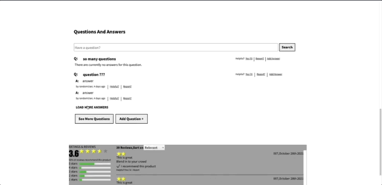
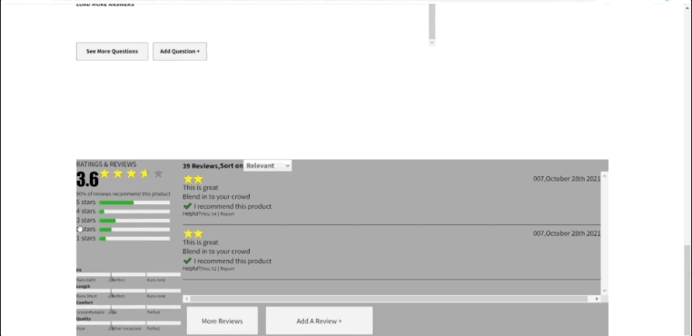

# Ratchadamri

### Table of Contents

1. [General Info](#🌴-General-Info)
2. [Demo](#✨-Demo)
3. [Technologies](#🧪-Technologies)
4. [Installation](#🚀-Installation)
5. [FAQs](#FAQS)
6. [Contributors](#🤝-Contributors)

### General Info

An e-Commerce website that delivers products to the user.

### ✨ Demo 

Product Overview

Questions and Answers

Ratings and Reviews

### 🧪 Technologies

         

### 🤝 Contributors

##### Overview

- [Travis Pak](https://www.linkedin.com/in/travis-pak-5b2851104/)

##### Related Products

- [Stephen McDaniel](https://www.linkedin.com/in/victor-mcdaniel/)

##### Q/A

- [Jason Adams](https://www.linkedin.com/in/jason-adams-b88086146/)

##### Ratings & Reviews

- [Darron McIntyre](www.linkedin.com/in/darron-mcintyre90)
